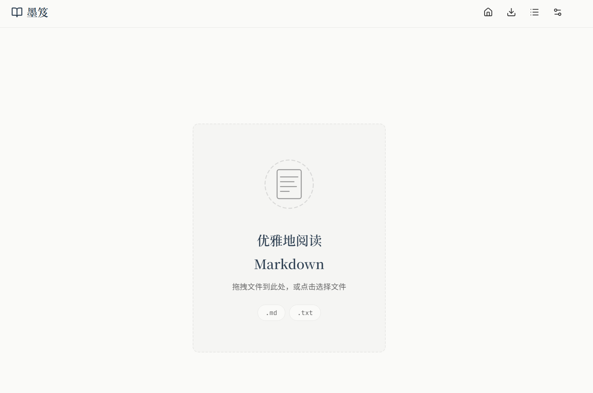
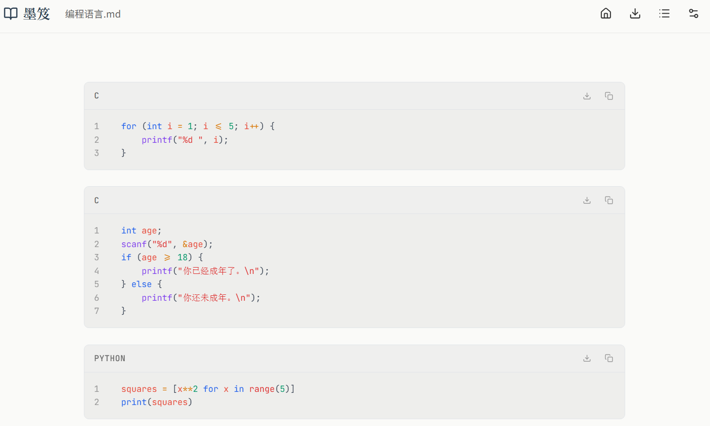
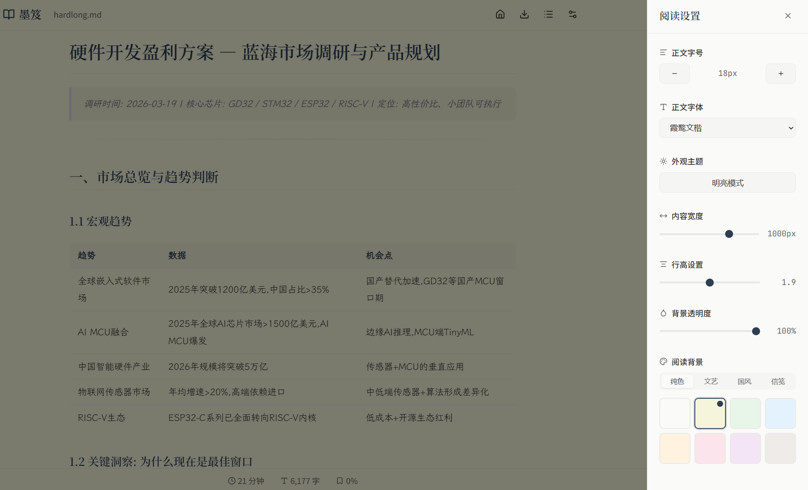

# 墨笈 · 优雅 Markdown 阅读器

## 1. 概念与愿景

**产品理念**：打造一个让阅读成为一种享受的Markdown阅读器。灵感来源于纸质书籍的阅读体验，结合现代数字阅读的便捷性。整体设计追求"静谧、专注、优雅"，让读者沉浸在文字的海洋中，忘却技术的存在。

**核心体验**：如同在精致的书房中翻阅一本好书，每一个排版细节都为阅读服务。

**主页展示**：简约的主页，随时点击标题栏返回主页即可回到主页到导入新的文件

**代码块**：展示行号与字体颜色，便于导出和复制，代码块右上角可直接导出为对于编程语言的文件如.c和.py等

**目录显示**：点击标题栏的目录按钮即出现，点击各层级目录可跳转

**背景设置**：支持背景风格调整，文字大小和字体修改，更多风格正在开发

**导出文档**：默认导出为PDF格式

## 2. 设计语言

### 美学方向
灵感来源：日式极简美学 + 北欧现代设计 + 传统书籍排版
- 大量的留白，让眼睛有呼吸的空间
- 精致的细节处理，体现匠心
- 柔和的色彩过渡，营造沉浸式阅读氛围

### 字体系统
- 标题字体: `"Noto Serif SC", "Source Han Serif CN", serif` (中文宋体，优雅传统)
- 正文字体: `"Noto Sans SC", "Source Han Sans CN", -apple-system, sans-serif` (清晰易读)
- 代码字体: `"JetBrains Mono", "Fira Code", "Source Code Pro", monospace`
- 字体大小: 基础18px，行高1.8
- 段落间距: 1.5em

### 空间系统
- 基础单位: 8px
- 内容最大宽度: 720px (最佳阅读宽度)
- 页面边距: 48px (桌面) / 24px (移动)
- 组件间距: 24px
- 段落间距: 1.5em

### 动效哲学
- 主题切换: 柔和的渐变过渡 (0.3s ease)
- 滚动阅读进度: 平滑的进度条动画
- 文件拖拽: 优雅的悬浮效果
- 页面加载: 淡入效果 (opacity 0→1, 0.5s ease-out)
- 所有动效追求"轻盈、自然"，不打断阅读节奏

### 视觉资源
- 图标: 使用Lucide Icons (线条简洁，与设计语言一致)
- 装饰: 极简的线条分隔，少量几何装饰
- 无图片依赖，纯CSS实现所有视觉效果

### 响应式策略
- **桌面 (>1024px)**: 完整布局，最大宽度720px居中
- **平板 (768-1024px)**: 边距缩小为32px
- **手机 (<768px)**: 边距16px，字体缩小到16px，工具栏简化

## 3. 功能与交互

### 核心功能

**1. 文件加载**
- 拖拽上传: 拖拽文件到整个页面，触发蓝色边框高亮 + 提示文字
- 点击上传: 点击中心区域打开文件选择器
- 支持格式: .md, .txt
- 文件大小限制: 10MB
- 错误处理: 文件类型错误显示优雅的提示

**2. Markdown渲染**
- 完整支持GFM (GitHub Flavored Markdown)
- 标题 (h1-h6): 层级分明的标题样式
- 段落: 舒适的行高和间距
- 列表: 有序、无序、嵌套列表
- 代码块: 语法高亮 (使用 Prism.js 主题)
- 行内代码: 柔和的背景色
- 引用块: 左侧边框装饰 + 缩进
- 链接: 优雅的下划线 + hover效果
- 图片: 最大宽度100%，圆角处理
- 表格: 边框分明，表头高亮 (应用背景设置)
- 分割线: 精致的分隔装饰
- 任务列表: 复选框样式

**3. 主题切换**
- 点击切换按钮，smooth过渡
- 记住用户偏好 (localStorage)
- 支持系统主题跟随

**4. 阅读设置侧边栏**
- 内容宽度调节: 500px - 1200px
- 正文字体选择: 思源黑体/思源宋体/霞鹜文楷/系统字体
- 正文字号调节: 12px - 32px
- 行高设置: 1.4 - 2.4
- 阅读背景设置 (应用范围：网页背景、文本区域、表格)

**5. 阅读进度**
- 顶部细线进度条
- 实时更新 (滚动时)
- 百分比显示

**6. 阅读统计**
- 总字数
- 预计阅读时间 (按300字/分钟)
- 当前章节/总章节数

### 交互细节

**Hover效果**
- 链接: 颜色加深 + 下划线
- 按钮: 轻微上浮 + 阴影
- 代码块: 显示复制按钮
- 背景选项: 放大效果 + 选中标记

**点击效果**
- 按钮: 轻微下沉效果
- 列表项: 轻微背景色变化
- 背景选项: 圆点选中标记

**加载状态**
- 文件读取: 优雅的loading动画
- 渲染过程: 渐显内容

**空状态**
- 欢迎界面: 居中的拖拽提示
- 优雅的插图和引导文字

**错误状态**
- 文件类型错误: 红色边框闪烁 + 提示
- 文件过大: 友好的大小限制说明
- 读取失败: 优雅的错误提示 + 重试选项

## 4. 组件清单

### 1. 顶部工具栏 (Header)
- **默认**: 白色/深色背景，微妙阴影
- **固定**: 始终在顶部
- **内容**: 标题文本、文件名称、设置按钮、主题切换按钮

### 2. 设置按钮 (SettingsToggle)
- **默认**: 齿轮图标
- **Hover**: 背景色变化
- **Active**: 点击缩放效果

### 3. 主题切换按钮 (ThemeToggle)
- **默认**: 太阳/月亮图标
- **Hover**: 图标旋转 + 颜色变化
- **Active**: 点击缩放效果
- **过渡**: 图标切换动画

### 4. 设置侧边栏 (SettingsSidebar)
- **默认**: 从右侧滑入，遮罩层
- **内容**: 宽度、字体、字号、行高、背景设置
- **关闭**: 点击关闭按钮或遮罩层

### 5. 文件上传区域 (DropZone)
- **默认**: 虚线边框，居中内容
- **Hover**: 边框颜色加深
- **拖拽中**: 边框高亮 + 背景色变化
- **错误**: 红色边框 + 错误信息

### 6. Markdown内容区 (ContentArea)
- **默认**: 渲染后的Markdown内容，应用背景设置
- **加载中**: 内容渐显
- **空状态**: 欢迎界面

### 7. 表格样式 (Tables)
- **默认**: 应用背景设置，与内容区域一致
- **表头**: 稍深的背景色
- **悬停**: 行背景高亮

### 8. 进度条 (ProgressBar)
- **默认**: 3px高度，主题色渐变
- **滚动**: 平滑宽度变化
- **到顶/到底**: 微妙的边界效果

### 9. 状态栏 (StatusBar)
- **默认**: 固定底部，半透明背景
- **内容**: 进度百分比、字数、阅读时间

### 10. 代码块 (CodeBlock)
- **默认**: 深色背景，语法高亮
- **Hover**: 显示复制按钮
- **复制成功**: 按钮文字变化 + 成功提示

## 5. 技术方案

### 技术栈
- **框架**: 纯HTML + CSS + JavaScript (无框架依赖)
- **Markdown解析**: marked.js (CDN)
- **语法高亮**: Prism.js (CDN)
- **图标**: Lucide Icons (CDN)
- **字体**: Google Fonts (Noto Serif SC, Noto Sans SC, LXGW WenKai)

### 关键实现
1. **Markdown解析**: 使用marked.js，配置GFM模式
2. **语法高亮**: Prism.js，自动检测语言
3. **主题管理**: CSS变量 + localStorage
4. **背景管理**: CSS变量 + inline样式，应用到body/markdown-content/tables
5. **文件读取**: FileReader API
6. **进度计算**: scroll事件 + scrollHeight
7. **响应式**: CSS媒体查询

### 背景应用范围
1. **网页背景 (body)**: 全局背景
2. **文本区域 (.markdown-content)**: 阅读内容容器
3. **表格元素 (table)**: Markdown中的表格

### 性能优化
- 延迟渲染大文件
- 滚动节流
- CSS硬件加速动画
- 背景图案使用CSS实现，无需额外网络请求

## 6. 彩蛋与隐藏功能 🥚

为了让阅读体验更具惊喜感，我们埋藏了一些小彩蛋：

**1. 键盘侠的致敬 (Konami Code)**
在任意页面依次按下 `↑ ↑ ↓ ↓ ← → ← → B A`，界面将短暂进入“黑客帝国”数字雨模式，随后恢复平静。这是对经典极客文化的致敬。

**2. 诗意加载语**
每次打开新文件时，加载动画旁会随机显示一句关于阅读或写作的短句（如：“文字是思想的翅膀”、“在空白处遇见灵感”），让等待也变得优雅。

**3. 深夜模式自动触发**
除了手动切换，当系统时间处于 22:00 - 06:00 且检测到环境光传感器支持时（部分设备），应用会温柔地提示是否进入“护眼深夜模式”。

**4. 字数成就系统**
- 阅读满 10,000 字：解锁“初窥门径”徽章
- 阅读满 100,000 字：解锁“博览群书”徽章
- 连续阅读 7 天：解锁“持之以恒”徽章
*(徽章仅本地存储，作为你阅读旅程的私密纪念)*

---

> **墨笈** 不仅是一个工具，更是你数字书房中的一盏灯。
> 愿你在每一次翻页中，找到内心的宁静。