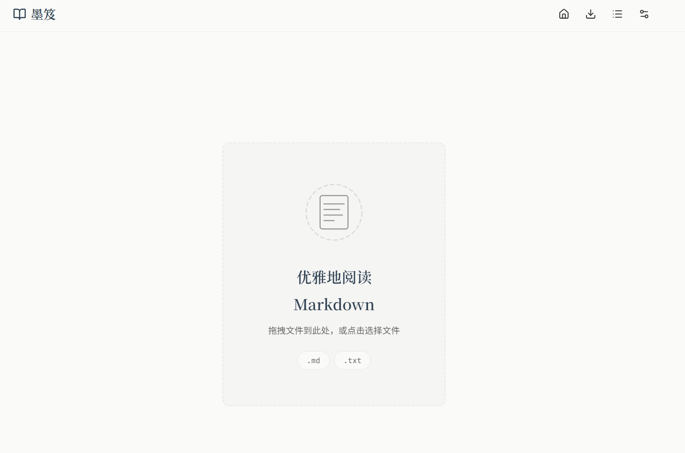
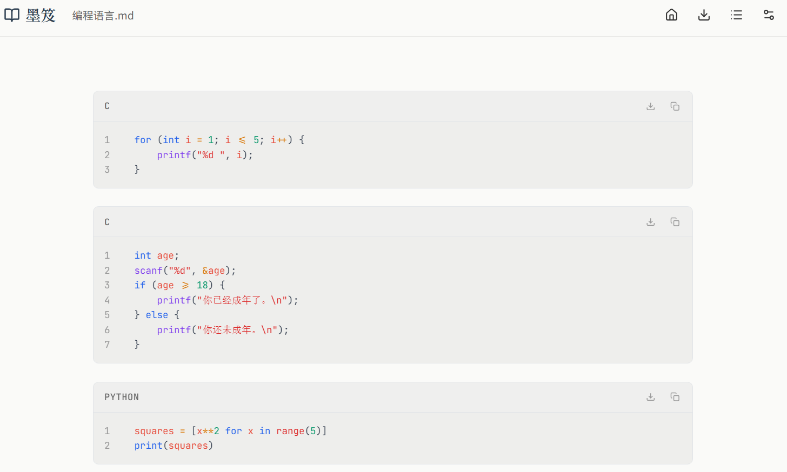
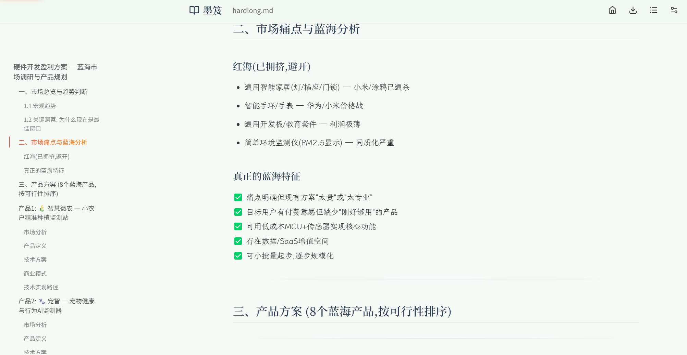
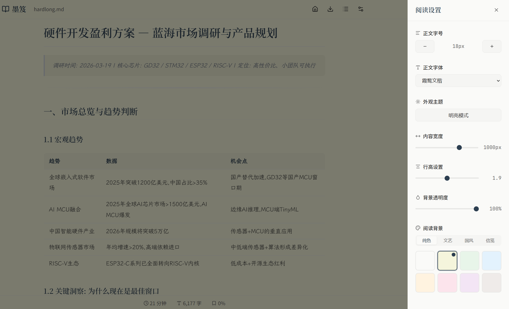
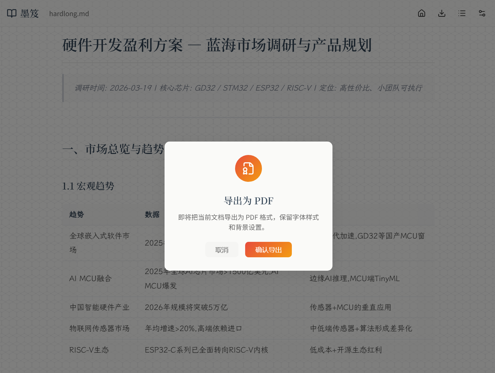

# 墨笈 · 优雅 Markdown 阅读器

> 只想先跑起来？直接看第 7 节「快速开始与部署」。

## 1. 概念与愿景

**产品理念**：打造一个让阅读成为一种享受的Markdown阅读器。灵感来源于纸质书籍的阅读体验，结合现代数字阅读的便捷性。整体设计追求"静谧、专注、优雅"，让读者沉浸在文字的海洋中，忘却技术的存在。

**核心体验**：如同在精致的书房中翻阅一本好书，每一个排版细节都为阅读服务。

**主页展示**：简约的主页，随时点击标题栏返回主页即可回到主页到导入新的文件

**代码块**：展示行号与字体颜色，便于导出和复制，代码块右上角可直接导出为对于编程语言的文件如.c和.py等

**目录显示**：点击标题栏的目录按钮即出现，点击各层级目录可跳转

**背景设置**：支持背景风格调整，文字大小和字体修改，更多风格正在开发

**导出文档**：支持导出为 TXT / MD / PDF（PDF 通过浏览器打印生成，保留字体与背景）

## 2. 设计语言

### 美学方向
灵感来源：日式极简美学 + 北欧现代设计 + 传统书籍排版
- 大量的留白，让眼睛有呼吸的空间
- 精致的细节处理，体现匠心
- 柔和的色彩过渡，营造沉浸式阅读氛围


### 字体系统
- 标题字体: `"Noto Serif SC", "Source Han Serif CN", serif` (中文宋体，优雅传统)
- 正文字体: `"Noto Sans SC", "Source Han Sans CN", -apple-system, sans-serif` (清晰易读)
- 代码字体: `"JetBrains Mono", "Fira Code", "Source Code Pro", monospace`
- 字体大小: 默认 18px（设置里 12 - 32px）
- 行高: 默认 1.9（设置里 1.0 - 2.5）

### 空间系统
- 基础单位: 8px
- 内容最大宽度: 默认 1200px（设置里可在 500 - 1400px 之间调节）
- 页面边距: 桌面 48px 垂直 / 24px 水平（平板 32px / 16px，手机 16px）
- 组件间距: 24px
- 段落间距: 默认 1.9（≈8px，设置里 1.0 - 2.5）

### 动效哲学
- 主题切换: 柔和的渐变过渡 (0.3s ease)
- 滚动阅读进度: 状态栏百分比实时更新（requestAnimationFrame 节流）
- 文件拖拽: 优雅的悬浮效果
- 页面加载: 淡入效果 (opacity 0→1, 0.5s ease-out)
- 所有动效追求"轻盈、自然"，不打断阅读节奏

### 视觉资源
- 图标: 使用Lucide Icons (线条简洁，与设计语言一致)
- 装饰: 极简的线条分隔，少量几何装饰
- 文艺背景: 内联 SVG 几何纹样（六边形 / 三角 / 菱形 / 节点连线），平铺
- 国风 / 信笺背景: `assets/bg/` 下 8 幅整幅 SVG 画面（绢荷 / 雾竹 / 云山 / 祥云洒金；鹤影青绿 / 桂花旧纸 / 回纹朱日 / 水彩荷塘），cover 铺满不平铺，均为本地文件、无外部网络请求


### 响应式策略
- **桌面 (>1024px)**: 完整布局，内容区按设置的宽度居中（默认 1200px）
- **平板 (768-1024px)**: 边距缩小为32px
- **手机 (<768px)**: 边距16px，字体缩小到16px，工具栏简化

## 3. 功能与交互

### 核心功能

**1. 文件加载**
- 拖拽上传: 拖拽文件到整个页面，触发蓝色边框高亮 + 提示文字
- 点击上传: 点击中心区域打开文件选择器
- 支持格式: .md / .txt / .log（.log 走日志渲染，自动清理 ANSI 控制符并高亮 shell 提示符）
- 文件大小限制: 6MB
- 错误处理: 文件类型不支持 / 超过大小限制时给出提示

**2. Markdown渲染**
- 完整支持GFM (GitHub Flavored Markdown)
- 标题 (h1-h6): 层级分明的标题样式
- 段落: 舒适的行高和间距
- 列表: 有序、无序、嵌套列表
- 代码块: 语法高亮 (Prism.js，本地 libs/) + 行号 + 语言标签 + 下载/复制按钮
- Mermaid 图: 代码块内是 Mermaid 语法时直接渲染成图（未指定配色的节点自动使用多种浅色；解析失败或编辑模式自动切回源码代码块，源码块与普通代码块同构：MERMAID 标题栏 + 行号 + 下载/复制）
- 行内代码: 柔和的背景色
- 引用块: 左侧边框装饰 + 缩进
- 链接: 优雅的下划线 + hover效果
- 图片: 最大宽度100%，圆角处理，图注右对齐到图片右边缘
- 表格: 边框分明，表头高亮 (应用背景设置)，第一列自适应内容宽度
- 分割线: 精致的分隔装饰
- 任务列表: 复选框样式

**3. 主题切换**
- 在「阅读设置」侧边栏内切换明亮 / 黑暗模式，smooth过渡
- 记住用户偏好 (localStorage)
- 支持系统主题跟随

**4. 阅读设置侧边栏**
- 内容宽度调节: 500px - 1400px（默认 1200px）
- 正文字体选择: 思源黑体/思源宋体/霞鹜文楷/系统字体
- 正文字号调节: 12px - 32px
- 行高设置: 1 - 2.5
- 段落间距: 1.0 - 2.5
- 段前缩进: 0 - 7 字（按段首空格实现，重新保存时自动继承）
- 图片显示: 「有图模式 / 无图模式」互切（默认有图；无图模式只隐藏正文图片与图注块，不改动原文）
- 背景不透明度: 0% - 100%（黑暗模式下禁用）
- 阅读背景设置 (应用范围：网页背景、文本区域、表格)
- 语言: 中文 / English
- 状态栏: 时长 / 字数 / 进度 可分别开关
- 按来源网站分别记忆: 同一网站（路径 / 后缀不同）的文章之间沿用上一篇的段前缩进与图片显示设置，不同网站各记各的

**5. 阅读进度**
- 滚动时实时更新，百分比显示在底部状态栏
- 目录面板高亮当前所在章节

**6. 阅读统计**
- 总字数
- 预计阅读时间 (按300字/分钟)

**7. 粘贴链接导入网页正文**
- 主页（非编辑模式）按 Ctrl+V 粘贴一个 http(s) 链接即自动抓取并解析
- 解析全部在浏览器完成：正文容器识别（站点规则 → 通用选择器 → Readability 式打分）→ 去广告/推荐/评论/导航 → 转 Markdown → 渲染（含 Mermaid 图、图注、作者时间行）
- **代码块原样保留**：正文清洗阶段不对 `<pre>` / `<code>` 内部做任何按类名的噪声剔除（否则掘金等站点代码块里的 `hljs-keyword` / `hljs-comment` / `hljs-tag` 会被当成「关键词 / 评论 / 标签」噪声删掉，多行注释被删还会把后面的行拼成一行）
- 正文图片不经代理，仍指向原站链接，由浏览器带 no-referrer 直接加载
- 重复导入：与当前正在阅读的文章是同一链接时直接跳过；此前解析过的链接走本地缓存复用，不再抓取、不占代理额度
- 目标站有 WAF（掘金等字节系）时，代理会在服务端自动求解挑战；仍失败则**自动重试一次**再报错
- 抓取需要同源代理 proxy.php，部署与配置见 §7

### 交互细节

**Hover效果**
- 链接: 颜色加深 + 下划线
- 按钮: 轻微上浮 + 阴影
- 代码块: 标题栏常驻「语言 + 下载 / 复制」按钮
- 背景选项: 放大效果 + 选中标记

**点击效果**
- 按钮: 轻微下沉效果
- 列表项: 轻微背景色变化
- 背景选项: 圆点选中标记

**加载状态**
- 文件读取: 优雅的loading动画
- 渲染过程: 渐显内容

**空状态**
- 欢迎界面: 居中的拖拽提示
- 优雅的插图和引导文字

**错误状态**
- 文件类型错误 / 超过 6MB: Toast 提示
- 读取失败: Toast 提示，可重新选择文件

## 4. 组件清单

### 1. 顶部工具栏 (Header)
- **默认**: 白色/深色背景，微妙阴影
- **固定**: 始终在顶部
- **内容**: Logo、文件名称、返回主页、编辑、导出（TXT / MD / PDF 下拉）、目录、阅读设置按钮
- **编辑模式**: 额外展开格式工具栏（标题 / 强调 / 列表 / 代码块 / 表格 / 引用 / 链接 / 图片 / 撤回重做）

### 2. 设置按钮 (SettingsToggle)
- **默认**: 齿轮图标
- **Hover**: 背景色变化
- **Active**: 点击缩放效果

### 3. 主题切换按钮 (ThemeToggle)
- **位置**: 「阅读设置」侧边栏内（不在顶栏）
- **默认**: 太阳/月亮图标 + 「明亮模式 / 黑暗模式」文字
- **过渡**: 图标切换动画

### 4. 设置侧边栏 (SettingsSidebar)
- **默认**: 从右侧滑入，遮罩层
- **内容**: 字号、字体、外观主题、内容宽度、行高、段落间距、段前缩进、背景不透明度、语言、阅读背景、状态栏开关
- **关闭**: 点击关闭按钮或遮罩层

### 5. 文件上传区域 (DropZone)
- **默认**: 虚线边框，居中内容
- **Hover**: 边框颜色加深
- **拖拽中**: 边框高亮 + 背景色变化
- **错误**: 通过 Toast 提示（格式不支持 / 超过 6MB）

### 6. Markdown内容区 (ContentArea)
- **默认**: 渲染后的Markdown内容，应用背景设置
- **加载中**: 内容渐显
- **空状态**: 欢迎界面

### 7. 表格样式 (Tables)
- **默认**: 应用背景设置，与内容区域一致
- **表头**: 稍深的背景色
- **悬停**: 行背景高亮

### 8. 状态栏 (StatusBar)
- **默认**: 固定底部，半透明背景
- **内容**: 阅读时长、字数、进度百分比（每项可在设置里单独开关）
- **编辑模式**: 自动隐藏

### 9. 代码块 (CodeBlock)
- **默认**: 跟随主题的代码底色 + 语法高亮 + 行号
- **标题栏**: 常驻「语言标签 + 下载 / 复制」按钮
- **Mermaid 源码块**: 编辑模式下与普通代码块完全同构（MERMAID 标题栏 + 行号 + 下载/复制）；阅读模式下隐藏，只显示渲染后的图
- **编辑**: 块内粘贴按纯文本插入并自动同步行号

## 5. 技术方案

### 技术栈
- **框架**: 纯HTML + CSS + JavaScript（无框架、无构建步骤，第三方库以本地 `libs/` 为主）
- **Markdown解析**: marked.js
- **HTML → Markdown**: Turndown（编辑模式保存、URL 导入结果存档）
- **语法高亮**: Prism.js + 本地 tomorrow 主题
- **图表渲染**: Mermaid（文档出现 Mermaid 代码块时才动态加载）
- **编辑器**: 阅读/编辑复用同一份 contenteditable DOM（Tiptap 走 CDN 引入，当前未启用）
- **图标**: Lucide
- **字体**: Google Fonts（fonts.loli.net 镜像异步加载，离线自动回退系统字体）
- **抓取代理（可选，仅 URL 导入用）**: `proxy.php`（PHP，令牌校验 + 10 次/分钟限速）

### 关键实现
1. **Markdown解析**: marked.js 配置 GFM + 自定义 renderer，渲染后统一做代码块增强（行号 / 语言标签 / 下载复制）、表格列宽、图片包裹与图注对齐
2. **Mermaid 渲染**: 按语言标记或内容关键字识别 → 懒加载 mermaid → 渲染成 SVG；原文保留在隐藏源码块中，导出与编辑模式自动还原，解析失败降级回代码块
3. **语法高亮**: Prism.js，代码块内粘贴按纯文本插入并同步行号
4. **主题管理**: CSS变量 + localStorage
5. **背景管理**: CSS变量 + inline样式，应用到body/markdown-content/tables
6. **文件读取**: FileReader API
7. **阅读进度**: scroll事件 + requestAnimationFrame 节流 → 状态栏百分比
8. **URL 导入**: 服务端代取 HTML（proxy.php，必要时自动解 WAF 挑战）→ 浏览器内识别正文容器 / 清洗（代码块内部免清洗）/ 转 Markdown / 渲染；被 WAF 挡时自动重试一次
9. **响应式**: CSS媒体查询

### 背景应用范围
1. **网页背景 (body)**: 全局背景
2. **文本区域 (.markdown-content)**: 阅读内容容器
3. **表格元素 (table)**: Markdown中的表格

### 性能优化
- Mermaid（约 2MB）只在文档里出现 Mermaid 代码块时才动态加载
- 滚动 / resize 用 requestAnimationFrame 与防抖处理，避免频繁重排
- 背景图案与装饰全部用 CSS / 内联 SVG 实现，无额外网络请求
- 渲染 / 高亮 / 图表 / 转换所需的库都在本地 `libs/`：除字体（Google Fonts）与 Tiptap 的 CDN 引入外无其它外部请求，其余功能可完全离线使用

## 6. 彩蛋与隐藏功能 🥚

为了让阅读体验更具惊喜感，我们埋藏了一些小彩蛋：

**1. 键盘侠的致敬 (Konami Code)**
在任意页面依次按下 `↑ ↑ ↓ ↓ ← → ← → B A`，立即提示“🎮 欢迎进入宇宙源码！”，界面将进入“宇宙源码”数字雨模式，直到用户输入S后退出。这是对经典极客文化的致敬。

**2. 诗意加载语**
每次打开新文件时，加载动画旁会随机显示一句关于阅读或写作的短句（如：“文字是思想的翅膀”、“在空白处遇见灵感”），让等待也变得优雅。

**3. 字数成就系统**
- 阅读满 10,000 字：解锁“初窥门径”徽章
- 阅读满 100,000 字：解锁“博览群书”徽章
- 连续阅读 7 天：解锁“持之以恒”徽章
*(徽章仅本地存储，作为你阅读旅程的私密纪念)*

---

## 7. 快速开始与部署

### 直接阅读（无需服务器）
双击 `index.html` 即可使用：打开 / 拖拽 `.md`、`.txt`、`.log`，渲染、编辑、导出、设置全部可用（仅「粘贴链接导入」需要服务器，见下）。

### 本地起个静态服务（推荐）
```bash
python -m http.server 8090        # 或任意静态服务器
# 浏览器打开 http://localhost:8090/index.html
```

### 启用「粘贴链接导入网页正文」
导入需要同源代理代取网页（浏览器直连会被目标站 CORS 拦住），在与 `index.html` 同目录执行：

```bash
# PowerShell
$env:PHP_CLI_SERVER_WORKERS=4; php -S localhost:8081
# macOS / Linux
PHP_CLI_SERVER_WORKERS=4 php -S localhost:8081
```

然后访问 http://localhost:8081/index.html ，在主页按 `Ctrl+V` 粘贴链接即可。

### 代理配置（部署到公网前必看）
`proxy.php` 顶部的配置项：

| 配置 | 默认 | 说明 |
|---|---|---|
| `$PROXY_TOKEN` | 代码里的占位符（**请自行改成随机串**） | 访问令牌，**必须与 `scripts/reader/url-importer.js` 的 `PROXY_TOKEN` 一致**；不一致会提示「代理令牌校验失败」。生成随机串：`php -r "echo bin2hex(random_bytes(16));"` |
| `$RATE_MAX` / `$RATE_WINDOW` | 10 / 60 | 同一 IP 每 60 秒最多 10 次抓取，超出返回 429，前端提示还需等待多少秒 |
| `$REPEAT_TTL` | 600 | 同一链接在该秒数内再次抓取**不占用**上面的次数额度（响应头带 `X-RateLimit-Repeated: 1`）；重复抓取本身另有 3×额度的宽松上限 |
| `$MAX_FETCH_BYTES` | 8388608（8MB） | 单次响应体积上限（与前端 `MAX_HTML_BYTES` 对齐）。超出会**立刻断开上游连接**并返回 502，不会把大文件读进内存再转发 |
| `$ALLOW_NO_ORIGIN` | `true` | 同源校验的宽松档：为 `true` 时放行「没有 Origin/Referer/Sec-Fetch-Site」的请求（curl、脚本直连）；置 `false` 后这类请求也拒绝 |
| `$EXTRA_ALLOWED_HOSTS` | `[]` | 反向代理改写了 Host、导致本站 Origin 对不上时，把本站域名填进来（可只写域名，如 `['mojian.example.com']`） |
| `$RATE_DIR` | 系统临时目录 | 限速计数文件位置；目录不可写时会自动放行限速（不影响功能） |
| `$TRUST_PROXY_HEADER` | `false` | 跑在 Cloudflare / Nginx 反代后面时置 `true`，改用真实访客 IP 分桶（同时用 `X-Forwarded-Proto` 判断默认端口） |
| `$FALLBACK_FETCH` | `''`（关闭） | 备用抓取端点，用 `{url}` 占位目标地址。**直连拿到目标站的 WAF 挑战页、服务端解不开时自动改走它**，把「要干净出口 IP」的那一层检查转出去，例如 `https://my-worker.example.workers.dev/?url={url}`、`https://api.scraperapi.com/?api_key=xxx&url={url}`；命中时响应头带 `X-Proxy-Via: fallback` |
| `$FALLBACK_TIMEOUT` | 20 | 备用端点的总超时（秒） |
| `$WAF_MAX_ROUNDS` | 4 | 服务端解 WAF 挑战的最大重试轮数（一轮 = 解一次 SHA-256 工作量证明 + 带 `_wafchallengeid` 重抓，多一个 RTT）。多数情况第 1 轮就过；调大有成本（失败时每个 RTT 都要等），调小则更容易卡在中途 |

部署后自检：直接打开 `https://你的域名/proxy.php?ping=1`，应返回类似
`{"ok":true,...,"token":true,"rate":"10/60s","repeat":"reuse 600s","max":8388608,"origin":"allow-no-origin","fallback":false,"waf":"4 rounds"}`。
其中 `curl` / `fopen` 两个字段告诉你抓取实际走的是哪条分支：

- **装了 `curl` 扩展** → 用 curl（首选）；
- **没装但 `allow_url_fopen=On`** → 退回 `file_get_contents`（PHP 内置 HTTP 流封装，同样是真正的 GET）。

两条分支的**请求形状与行为边界已对齐**：同一套 UA / `Accept` / `Accept-Language` / 跳转上限 / 12s 总耗时上限 / 8MB 体积上限（上游声明 `Content-Length` 超限时连正文都不下载）。仍存在两点无法对齐的客观差异：流封装最高只到 **HTTP/1.1**（curl 在 https 下通常协商 h2），且**不支持 gzip/br 协商**（所以它会显式声明 `Accept-Encoding: identity`，宁可多传字节也不收到压缩字节）。

#### 同源校验挡得住什么
`url=` 抓取默认只接受**本站页面**发起的请求（`ping` 不受影响）：

- 浏览器会强制带上 `Sec-Fetch-Site`，第三方网页伪造不了：`cross-site` / `same-site` 一律 403。这挡住了「别的网站把你的代理当免费代理、甚至当肉鸡用」，并且校验放在限速之前，跨站请求不占你的额度；
- 浏览器没给 `Sec-Fetch-*` 时，退化为比对 `Origin` / `Referer` 的 host 与本站 host（含端口），不一致即 403；
- 地址栏直接打开 `proxy.php?url=...`（`Sec-Fetch-Site: none`）、本站前端调用、`curl` 自检（默认档）都正常通过；
- 响应里的 `Access-Control-Allow-Origin` 也只在来源为本站时才回发（不再是无条件 `*`）。

需要说清楚的是：**令牌写在页面里，用户一打开开发者工具就能看到**（Network 面板的查询串、`scripts/reader/url-importer.js` 源码、控制台里的 `Mojian.urlImporterDebug`），`Sec-Fetch-Site` 之类的头也能被脚本伪造。所以这一层挡的是「扫到 `/proxy.php` 就白用」的盲扫与跨站滥用，不是有心人。真要限死访问，请给整站加一层认证（HTTP Basic / Cloudflare Access）、或给代理加域名白名单，并保持令牌为随机串、限速开启。

### 部署形态对照

| 形态 | URL 导入 | 说明 |
|---|---|---|
| PHP 虚拟主机（cPanel 等） | ✅ | 整个目录原样上传即可，无需改代码 |
| 本地 `php -S` | ✅ | 开发与自用最方便 |
| 纯静态托管（Vercel / Netlify / Cloudflare Pages / Wasmer） | ❌ | 不执行 PHP，`proxy.php` 只会被当静态文件返回；需另写一个 `fetch` 版 Serverless 函数端点，再把 `LOCAL_PROXY_PING` 与 `FETCH_CHANNELS[0].template` 指向该端点 |
| `file://` 直接打开 | ❌ | 除 URL 导入外功能齐全 |

> 内置的公共 CORS 代理（allorigins / codetabs / corsproxy）只是兜底通道，实测不稳定，且会把目标 URL 交给第三方，不建议依赖。

> **免费虚拟主机的一个坑（一）——本站自己的反爬**：iFastNet / InfinityFree 系（如 iceiy.com 等）会给**没有 `__test` Cookie** 的请求返回一段 `aes.js` 反爬挑战页（HTTP 200 + HTML，内容约 1KB），而不是真正的响应。前端抓取按 `credentials: 'same-origin'` 带上本站 Cookie，所以：**必须先在浏览器里正常打开过本站页面（跑完挑战、拿到 `__test` Cookie）**，粘贴导入才可用；若控制台出现「拿到的是本站主机的反爬挑战页」，刷新页面通过挑战后再试即可（Cookie 有效期 6 小时）。

> **免费虚拟主机的一个坑（二）——目标站自己的 WAF**：有些站点（最典型的是掘金，字节系）会给「可疑来源」——机房/共享 IP、非浏览器 TLS 指纹——返回一个约 2KB 的 **JS 挑战页**（`waf-jschallenge` / `out-sha256.js`）。典型现象：主机侧 `proxy.php?url=<掘金链接>` 只返回 2KB HTML，而同样的链接本机抓取正常。实测：iFastNet 免费主机出口 IP 为英国机房 IP（`185.27.134.x`，AS34119），同一时刻本机（家宽）直连掘金可拿到 126KB 真实页面。注意**同一个出口 IP 的放行与否是概率性的**——直连有时直接给正文（`X-Proxy-Via: direct`），有时才给挑战页，所以「换个时间点试一下」可能就过了。
>
> 这类挑战页 `proxy.php` **能在服务端直接解开**（见下面「WAF 挑战求解」一节），不需要 JS 引擎、也不需要外部服务。解不开时才会退回 `$FALLBACK_FETCH`；再解不开，前端会**自动重试一次**，仍失败才提示「该站点启用了反爬（WAF）」——不再报含糊的「正文为空」。

#### WAF 挑战求解

字节系挑战页本质是一道 **SHA-256 工作量证明**：页面里带一份 base64 的 `{v:{a,c}, s}`（`a` = 前缀字节，`c` = 期望摘要），要求找到 `i` 使 `SHA256(a || str(i)) == c`，命中后把 `{v,s,d}` 重新编码成 `_wafchallengeid` Cookie 再 reload。浏览器靠 JS 暴力试；服务端挑的 `i` 通常是个位数，PHP 直接 `hash()` 毫秒级就能解出。

`proxy.php` 的处理链路：

1. 直连拿到 HTML，若体积 ≤ 12KB 且命中 `waf-jschallenge` / `out-sha256.js` / `waf_js` / `__cf_chl_` / `Just a moment...` 等特征 → 判定为挑战页；
2. 解出 `_wafchallengeid`，写进临时 cookie jar（`tempnam()` 创建，请求结束即 `unlink`），带 Cookie 重抓；
3. 仍是挑战页就再解一轮，最多 `$WAF_MAX_ROUNDS`（默认 4）轮——**挑战页的 nonce 会轮换**，第一轮解出的凭证可能因服务端换 prefix 而失效，所以需要多轮；
4. 解开后正常返回，响应头带 `X-Proxy-Via: waf-solved`；
5. 轮数用尽仍是挑战页 → 若配了 `$FALLBACK_FETCH` 则改走它（`X-Proxy-Via: fallback`），否则前端收到 `WAF_BLOCKED`，**自动重试一次**后提示用户。

**这套流程是无状态的**：cookie jar 每个请求现建现删，挑战凭证从不跨请求复用，因此不存在「cookie 过期导致永久失效」。代价是每次都要重新解一遍，但也因此不会因为残留的坏状态而卡死。

真正会导致「某天突然全站抓不到」的不是过期，而是**挑战页格式变更**——求解强依赖 `cs="…"` 里的 `v.a` / `v.c` / `s` 三个字段，对方一改名字或换算法就会解不出来（前端控制台会打印「目标站启用了 WAF 反爬，服务端抓不到正文」并给出配置 `$FALLBACK_FETCH` 的提示）。这时唯一稳妥的出路是配置 `$FALLBACK_FETCH`，把这一层检查交给出口 IP 干净的一方（自建 VPS / 家宽 + Cloudflare Tunnel / 带 JS 渲染的抓取 API，都用 `{url}` 占位目标地址）。注意免费公共中转（allorigins / codetabs / corsproxy / r.jina.ai）实测同样过不了掘金的 WAF —— allorigins 拿到的也是那张挑战页，所以别指望用它们顶替。

> 另有一个**浏览器侧**的 cookie 陷阱，容易和上面混淆：免费虚拟主机自己（iFastNet / InfinityFree 系）的 `__test` Cookie 有效期约 6 小时，过期后必须先在浏览器里正常打开一次本站页面跑完挑战，粘贴导入才会可用。区分方法很简单——控制台报「**本站主机**的反爬挑战页」是这一层（刷新页面即解），报「**目标站**返回 WAF 挑战页」才是上面那层。

## 8. 目录结构

```
index.html              入口（无构建步骤）
proxy.php               同源抓取代理（可选，仅 URL 导入需要）
daodejing.txt           示例文本
img/                    README 截图 + favicon.svg（标签页图标，与标题栏书本符号一致）
assets/bg/              国风 / 信笺阅读背景（8 幅整幅 SVG 画面，本地文件）
libs/                   本地第三方库（marked / Prism / Mermaid / Turndown / Lucide）
styles/                 样式（变量 / 布局 / 内容 / 编辑器 / 弹窗 / TOC / 响应式…）
scripts/
  core/                 全局状态、通用工具、设置、段前缩进、图片显示、按站点偏好、懒加载
  reader/               渲染（含 Mermaid）、背景与主题、进度、目录、URL 导入
  editor/               编辑模式、工具栏、HTML→Markdown、撤销重做
  file/                 文件读取与本地存档
  export/               TXT / MD / PDF 导出
  keyboard/             快捷键
  ui/                   侧边栏、Toast、文件名编辑
  easter-eggs/          彩蛋（Konami、数字雨、诗意加载语、成就徽章）
  app.js / i18n.js      入口与中英文案
```

> **改了 `scripts/` / `styles/` 之后**：请同步改掉 `index.html` 里各资源链接的 `?v=` 版本号；若改的是 `styles/` 目录下的样式，也要改 `index.html` 中对应的 `<link rel="stylesheet" ... ?v=>`（样式已改为在 HTML 中直接并行声明，`styles/main.css` 不再是入口，只作为样式清单索引），否则浏览器可能继续使用旧脚本 / 旧样式，出现「代码块样式错乱」这类假故障。
>
> ⚠️ **第三方主题必须先于本站样式加载**：`libs/prism-tomorrow.min.css` 在 `index.html` 里排在所有 `styles/*.css` **之前**，且不要往回挪。它带着 `:not(pre)>code[class*=language-]{white-space:normal;padding:.1em}` 这条规则，而代码块增强后 `<code>` 已被移出 `<pre>`、放进 `div.code-container`，`:not(pre)` 成立就会命中它——两条选择器特异性相同 (0,1,2)，谁后加载谁生效，主题排后面就会把代码里的换行折叠成空格（表现为「行号正常、代码全挤在第一行」）。为保险起见，`styles/content.css` 里代码块规则同时挂了 `.markdown-content .code-container code`（特异性 (0,2,1)），即便顺序被改也不会失效。
>
> ⚠️ **正文清洗不要按类名删代码块内部元素**：`scripts/reader/url-importer.js` 的 `cleanContainer()` 用 `NEGATIVE_RE` 类名黑名单剔除广告/评论/推荐等噪声，但代码块里满是 `hljs-*` 高亮标签，其中 `hljs-keyword`（命中 `keyword\w*`）、`hljs-comment`（命中 `comment\w*`）、`hljs-tag` / `hljs-selector-tag`（命中 `tag\w*`）会被误判成噪声整段删除——关键字和注释凭空消失，多行注释里的换行也跟着丢，代码块被挤成一行。因此所有破坏性清洗前都要先用 `inCodeBlock(el)` 判一下，`<pre>` / `<code>` 内部一律跳过。
>
> **首屏加载策略**：`libs/turndown.js`、`scripts/editor/*`、`scripts/export/export.js`、`scripts/reader/url-importer.js`、`scripts/easter-eggs/matrix-rain.js`、`libs/prism*.js` 已移出首屏关键路径，由 `scripts/core/lazy-loader.js` 在首屏绘制后的空闲时段注入，并在「编辑 / 导出 / 矩阵雨」等交互触发时提前加载。若新增首屏用不到的脚本，请登记到 `lazy-loader.js` 的 `DEFERRED_FILES`，并确认所有调用处都做了「未就绪」守卫。
>
> **按站点记忆的阅读偏好**：`scripts/core/site-prefs.js` 以 hostname 为维度，在 localStorage 的 `mojianSitePrefs` 下分别记录每个来源网站的「段前缩进」与「图片显示」。导入同站（路径 / 后缀不同）的文章时自动沿用该站记录，不同网站互不混淆；手动调整这两项设置时也会即时写回当前文章所属站点。本地文件无来源站点，不参与该记录。

---

> **墨笈** 不仅是一个工具，更是你数字书房中的一盏灯。
> 愿你在每一次翻页中，找到内心的宁静。